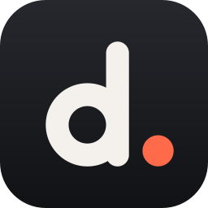

# deckhand.

**Install Windows programs and games on your Steam Deck. Pick the installer; the program ends up in your Steam library.**

Deckhand is an installer, not a launcher: once something is installed you play it from Steam like anything else.

1. Open Deckhand. Setup files in Downloads, on the Desktop or on an SD card/USB drive are already on screen. Pick one, or **Browse files**.
2. Click through the installer as usual.
3. Done: the program is in your Steam library, with its icon and library artwork.

Built for the Deck: four sections down the left (**Install · Stream · Add-ons · Installed**, switch with **L1/R1** or tap), full controller support (D-pad/stick to move, **A** select, **B** back, **X** browse, **☰** menu), big touch targets, button hints along the bottom, and full screen in Game Mode.

## What it does for you

- **Picks Proton:** GE-Proton if you have it, otherwise Proton Experimental or the newest Proton installed (including on the SD card). If you have none, it offers a one-tap install through Steam.
- **Runs Proton the way Steam does**, inside the Steam Linux Runtime, so installers that download files work. If the runtime isn't installed yet, it offers a one-tap install through Steam.
- **Gives each program its own Windows setup (prefix)**, so one program can't break another.
- **Shows your internal storage as D: in the installer.** Proton normally offers only C: and Z: ("rootfs", SteamOS's small read-only system partition), which makes installers complain about space. While installing, Z: is hidden and D: is your home folder. Z: comes back afterwards so the program runs normally.
- **Finds the installed program** from the shortcuts its installer made, skipping uninstallers, redistributables and crash reporters. If it can't tell, it shows its best guesses with their icons. Launches it the way its shortcut does, with the same arguments and start folder.
- **Adds it to Steam — once.** While Steam is running, Deckhand hands the program to Steam itself (the same hand-off SteamOS's own "Add to Steam" uses) — no restart needed — and never touches Steam's shortcut file: editing it behind a running Steam gets undone, or turns into duplicate shortcuts. If Steam hasn't saved its list yet, the program shows as "Sent to Steam" rather than being sent again. With Steam closed, the file is edited directly. Nothing that's already in Steam is added a second time. The program's own icon is used, and library artwork is generated (capsule, wide, hero, logo) so it doesn't show up as a blank tile; artwork you added yourself (SteamGridDB, Decky…) is never overwritten. If Steam files the shortcut under an ID of its own, Deckhand moves the artwork to it.
- **Adds it to the Desktop Mode app menu** (under Games), removed again on uninstall.
- **Frees space afterwards:** one tap deletes the installer, including GOG-style `.bin` parts.
- **Handles programs that need no install:** if the file *is* the program, it's added as-is — with its folder, if you want (portable programs usually need the files next to them).
- **Picks up interrupted installs:** if an install never finished (Deckhand was closed mid-install, the Deck turned off…), it shows up under Installed programs as an unfinished install: **Finish setup** adds what it installed to Steam without reinstalling, or delete it to free the space. Deckhand also offers this when it opens, and never touches a folder whose installer is still running.
- **Records DirectX setup errors:** if the installer runs Microsoft's DirectX setup, its own error log is copied into Deckhand's install log. (That setup often reports errors under Proton; Proton already includes DirectX, so programs usually run anyway.)
- **Shows real progress:** how much the installer has written so far and how fast, with an estimate against the installer's size for big installs, and a heads-up when nothing is happening because the installer is waiting for you. Flathub and EmuDeck downloads show a percentage.
- **Keeps the Deck awake while installing** (when the system allows it), so a long install isn't paused by sleep.

## Game streaming

Home → **Game streaming** (or ☰ Menu) adds streaming services to your Steam library, each with its own artwork:

| Service | How it runs |
| :--- | :--- |
| Xbox Cloud Gaming, GeForce NOW, Amazon Luna, Boosteroid | Full screen in Google Chrome (or Microsoft Edge, if you have it), controller enabled |
| Moonlight (stream from your gaming PC), chiaki-ng (PlayStation Remote Play) | Their own apps |

**Better xCloud** (optional, for Xbox Cloud Gaming): a free add-on ([redphx/better-xcloud](https://github.com/redphx/better-xcloud))
for a sharper picture, stream stats, Xbox remote play and mouse & keyboard. Choose **Add with Better xCloud**, or turn it on/off
later by picking Xbox Cloud Gaming again. It runs in Chromium (Google Chrome no longer lets it be loaded this way), is
installed without Tampermonkey, and updates itself in the background each time you start it.

The page shows which browsers and apps are already on the Deck, and what each service uses. Whatever a service needs is installed from Flathub for your user only, so no admin password is needed. Sign in the first time
you open it; leave with STEAM → Exit game. Picking a service again offers to remove it (the browser or app stays).

## Add-ons

The **Add-ons** section installs popular Deck add-ons from their official sources, using their own installers:

| Add-on | How |
| :--- | :--- |
| **Decky Loader** (decky.xyz) | Downloads Decky's own installer from github.com/SteamDeckHomebrew and opens it. It asks for your admin password (or offers a temporary one) and lets you install, update or uninstall. |
| **EmuDeck** (emudeck.com) | Downloads the latest EmuDeck from its GitHub releases into `~/Applications`, the way EmuDeck's own installer does, and opens it. |

Both set themselves up in Desktop Mode; from Game Mode, Deckhand offers to switch. Each shows whether it's already
installed.

**Already set up?** Deckhand recognises streaming services you added to Steam yourself (or with a guide or another tool), copies
of Moonlight or chiaki-ng that aren't from Flathub (AppImages, commands), and NVIDIA's GeForce NOW app. It won't add a second
shortcut unless you ask. When you pick a setup file, it also warns if your Steam library already has a program by that name.

## Install (Steam Deck)

1. Switch to **Desktop Mode** (hold Power → Switch to Desktop)
2. Open **Konsole** and paste:

```bash
curl -fsSL https://raw.githubusercontent.com/PossiblyPengu/deckhand/main/get.sh | bash
```

No pip, pacman, or developer mode needed. The script downloads the prebuilt binary and checks its checksum.

- To use Deckhand in Game Mode: **☰ Menu → Add Deckhand to Steam**.
- **Updates are built in:** when a new version is out, a banner on the home screen offers **Update now**; the download is checksum-verified and Deckhand restarts into it. You can also use **☰ Menu → Check for updates**, or `deckhand --update` in Konsole.
- In Desktop Mode you can also right-click any setup `.exe` → **Open With → Deckhand**.
- If a program shows "Sent to Steam" but isn't in your library, restart Steam (STEAM button → Power → Restart Steam).

## Where things go

Everything Deckhand keeps is in `~/.local/share/deckhand`.


| What | Where |
| :--- | :--- |
| Installed programs (one prefix each) | `~/.local/share/deckhand/prefixes/<name>/pfx/drive_c` |
| Launch scripts used by Steam | `~/.local/share/deckhand/launchers/` |
| Install logs, and each program's last launch (`<name>-launch.log`) | `~/.local/share/deckhand/logs/` |
| Backup of your Steam shortcuts | `…/userdata/<id>/config/shortcuts.vdf.deckhand-bak` |

**Uninstalling:** Home → **Installed programs** (or ☰ Menu → Installed programs). Each program shows its size and
whether it's still in Steam. Uninstalling deletes its Windows folder (including saves kept inside it), its folder on
D: if it was installed there, and its Steam shortcut, icon and artwork. While Steam is running (always, in Game Mode)
Deckhand leaves Steam's list alone and tells you to remove the shortcut in Steam (⚙ → Manage → Remove non-Steam
game). A program that isn't in Steam (you removed it, or Steam dropped it) shows "Not in Steam" and offers **Add to
Steam** — or uninstall to free the space.

**Duplicate shortcuts:** ☰ Menu → **Remove duplicate Steam shortcuts** keeps one of each and removes the extra copies
(of any non-Steam shortcut, not just Deckhand's). Steam must be closed for this: in Desktop Mode, exit Steam
(Steam menu → Exit), then open Deckhand from the app menu. A backup is saved as `shortcuts.vdf.before-dedupe`.

## Command line

```bash
deckhand                             # open the app
deckhand ~/Downloads/setup.exe       # open and offer to install that file
deckhand --update                    # update Deckhand itself
```

## Develop

```bash
pip install -r requirements.txt         # just PyQt6
python3 -m deckhand                 # run from source
QT_QPA_PLATFORM=offscreen python3 -m unittest discover -s tests -t .
./deckhand/build_onefile.sh         # → dist/deckhand
```

The tests use a fake Proton and fake Steam install, so they run anywhere, including CI. On minimal Linux images PyQt6 needs
`libegl1 libgl1 libglib2.0-0 libxkbcommon0 libdbus-1-3`. `DECKHAND_NO_GAMEPAD=1` turns off controller input;
`DECKHAND_FULLSCREEN=1` forces full screen outside Game Mode.

**Shipping a new version:** bump `__version__` in `deckhand/__init__.py`, then run
`scripts/publish_bin.sh "one line of release notes"` and commit `bin/`. That rebuilds the binary and writes
`bin/deckhand.json`, which `get.sh` and the in-app updater read (from `main`, then the development branch). Pushing a
`v*` tag also publishes a GitHub release; the updater checks releases too and takes whichever version is newest.
`DECKHAND_UPDATE_BASE=<url of a folder with deckhand.json>` points the updater elsewhere for testing.
